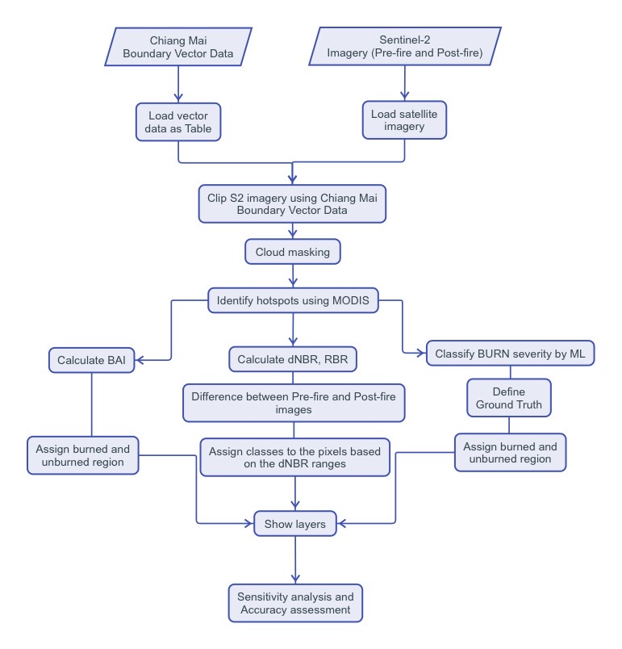
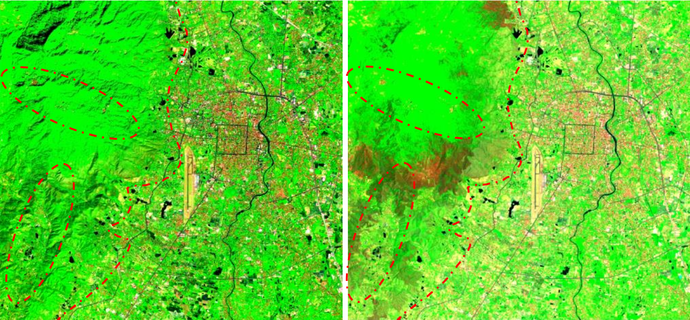
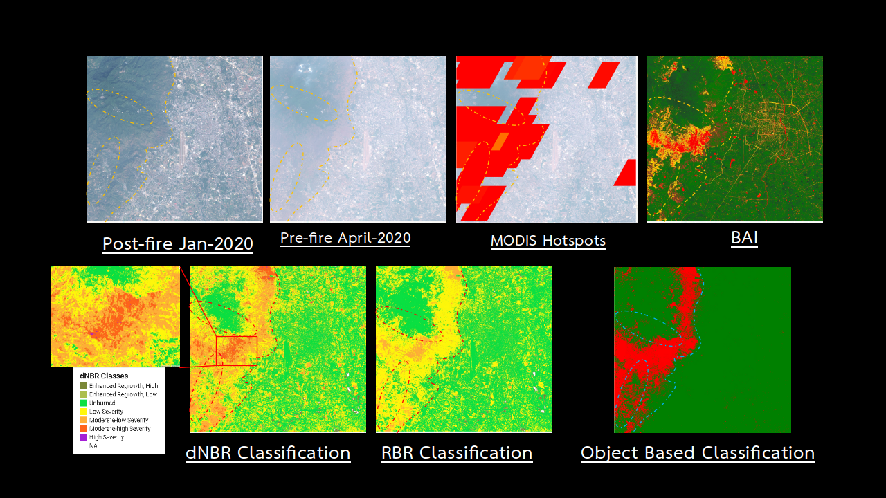
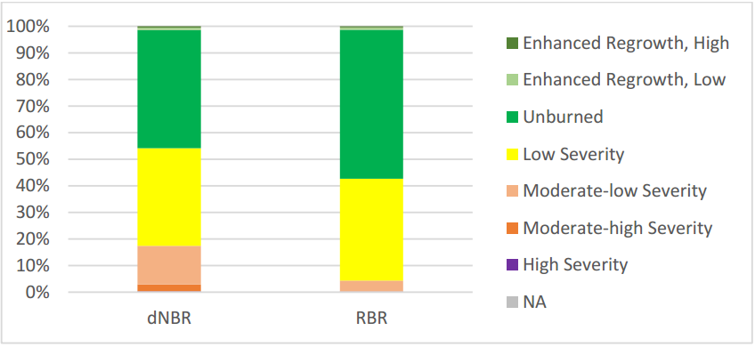
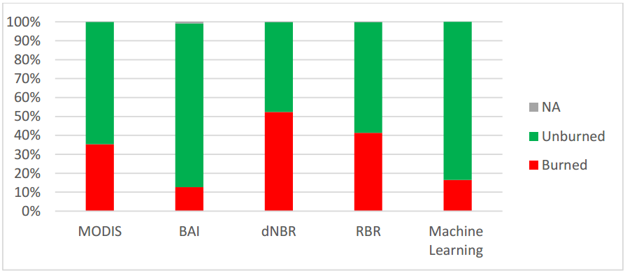

# Burn severity assessment: A case study of the 2020 wildfire in Chiang Mai, Thailand
This repository is the summary of my final project in AG2413 Digital Image Processing and Applications at KTH, Sweden.

Professor: prof. Yifang Ban and prof. Puzhao Zhang 

TA: Ritu Yadav

## Table of Contents
- [Introduction](#introduction)
- [Data preparation](#data-preparation)
- [Data analysis](#data-analysis)
- [Results](#results)
- [Sensitivity analysis](#sensitivity-analysis)

#
## Introduction
Chiang Mai is in northern Thailand. Almost 70% of its area is forest and agricultural fields. During
summer season, February to May, the temperature is increasing, and the moisture is decreasing.
Consequently, the accumulated dry leaves from winter season, October to January have become a large
source of fuel and agriculturist start to burn down their dried cultivated vegetation to plant new ones.

Those burn vegetation has become the main cause of air pollution since 2010. In 2020, there is a large
wildfire on Suthep mountain near the city center of Chiang Mai, and it is believed to be the largest one in
Thailand history, it was burning from 25 March to 30 March. This project will assess the severity of 2020
wildfire in Chiang Mai province area and have better understanding of using remote sensing technology to
assess burn severity mapping and practice using Google Earth Engine.

The overall process of the implementation could be seen in the figure below.

## Data preparation

This study uses before the wildfire date as 1 to 15 January 2020, after the wildfire date as 15 to
30 April 2020. The boundary vector data is in Chiang Mia province boundary located in the center of Chiang
Mai city with 155.2 km2 and where the wildfire occurred. Satellite images are taken from [SENTINEL-2](https://developers.google.com/earth-engine/datasets/catalog/sentinel-2).

## Data analysis
The satellite images from Sentinel-2 will be masked clouds using the pixel quality band of Sentinel-
2 SR data. Then, the imge will be mosaiced and clip based on the study area.

Additionally, [MODIS](https://developers.google.com/earth-engine/datasets/catalog/modis) was used to identify hotspots for estimating the location of the wildfire. The MODIS hotspot has resolution of 1 km.

Spectral indices in this study can be sperated into two types; [burned area index (BAI)](https://www.researchgate.net/publication/228788017_Assessment_of_different_spectral_indices_in_the_red-near-infrared_spectral_domain_for_burned_land_discrimination) and burned
severity classifiaction ([dNBR](https://www.researchgate.net/publication/241687027_Landscape_Assessment_Ground_measure_of_severity_the_Composite_Burn_Index_and_Remote_sensing_of_severity_the_Normalized_Burn_Ratio) and [RBR](https://www.mdpi.com/2072-4292/6/3/1827)). 

For BAI, only after the wildfire images are used for indentify burned area. For dNBR and RBR, the before
and after the wildfire images are used to classified severity

Object-based Image Classification is machine learning approach helping to classify burn area and
unburn area similar to BAI indic. It requires training set of data to train severity classification model. Due to
the lack of knowledge on the exact location of the wildfire in government data base. The location of burned area for train data set will be
approximately identified from local news and MODIS’ hotspot.

From the images above; Before the wildfire image (left) and after the wildfire image (right) in SWIR color composite ('B12','B8', 'B4')

The model is later tested it
on testing set of data and confusion matrix will be used to assess the model accuracy. The test data set is based from SWIR composite image and BAI image. 

## Results

Image from OBC could reduce the number of burn area around city center
significantly and the result is similar to SWIR color composite image and BAI image. With true positive of 23 367 and true negative of 675, precision of 99.98%, recall of 99.92%, and F1 score is 99.95%. The model is overfitting due to the small size of training set. The model could be improved by increasing the size of the training set.

## Sensitivity analysis

Since more than half of the study area cover by urban area it
is not possible that 40%, and more, of study area comprised with burned areas. Therefore, both dNBR and
RBR may not be accurate on this study area but there are still accurate in forest area.

BAI could detect the lowest number of burned area even though it includes water body and
road. The number is too low to reflect the real burn area. However, some location of burn area seems
accurate in the forest area. 

For MODIS, it could only give approximate location of hotspot and its cumulative
burn area is unreliable

Finally, ML classification could reduce noise in urban area. The image is accurate with the
ground truth and it gives a promising result. By visualizing, it could reflect what had happened in real
world
